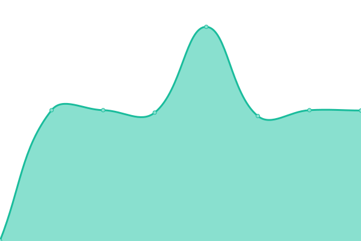
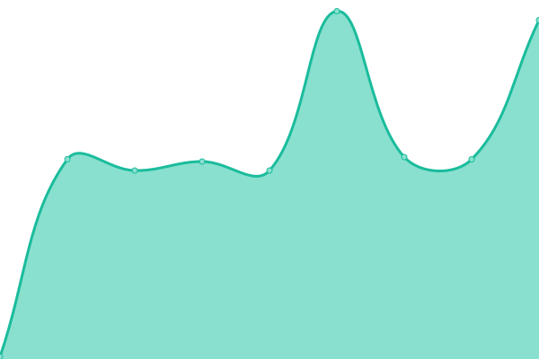

# [📈 Live Status](https://Bart0110.github.io/coronacheck-upptime): <!--live status--> **🟩 All systems operational**

This repository contains the open-source uptime monitor and status page for [Bart](https://Bart0110.github.io/coronacheck-upptime), powered by [Upptime](https://github.com/upptime/upptime).

With [Upptime](https://upptime.js.org), you can get your own unlimited and free uptime monitor and status page, powered entirely by a GitHub repository. We use [Issues](https://github.com/Bart0110/coronacheck-upptime/issues) as incident reports, [Actions](https://github.com/Bart0110/coronacheck-upptime/actions) as uptime monitors, and [Pages](https://Bart0110.github.io/coronacheck-upptime) for the status page.

<!--start: status pages-->
<!-- This summary is generated by Upptime (https://github.com/upptime/upptime) -->
<!-- Do not edit this manually, your changes will be overwritten -->
<!-- prettier-ignore -->
| URL | Status | History | Response Time | Uptime |
| --- | ------ | ------- | ------------- | ------ |
|  [TVS (Login) - Health](https://tvs.coronacheck.nl/health) | 🟩 Up | [tvs-login-health.yml](https://github.com/Bart0110/coronacheck-upptime/commits/HEAD/history/tvs-login-health.yml) | 

 424ms
     
 | 

<a href="https://Bart0110.github.io/coronacheck-upptime/history/tvs-login-health">100.00%</a>
    

|  [TVS (Login) - OpenID Config](https://tvs.coronacheck.nl/.well-known/openid-configuration) | 🟩 Up | [tvs-login-open-id-config.yml](https://github.com/Bart0110/coronacheck-upptime/commits/HEAD/history/tvs-login-open-id-config.yml) | 

 97ms
     
 | 

<a href="https://Bart0110.github.io/coronacheck-upptime/history/tvs-login-open-id-config">100.00%</a>
    

|  [TVS (Login) - Sorry Too Busy](https://tvs.coronacheck.nl/sorry-too-busy?client_id=cc_web&redirect_uri=&state=) | 🟩 Up | [tvs-login-sorry-too-busy.yml](https://github.com/Bart0110/coronacheck-upptime/commits/HEAD/history/tvs-login-sorry-too-busy.yml) | 

 381ms
     
 | 

<a href="https://Bart0110.github.io/coronacheck-upptime/history/tvs-login-sorry-too-busy">100.00%</a>
    

|  [Holder API - Config](https://holder-api.coronacheck.nl/v4/holder/config) | 🟩 Up | [holder-api-config.yml](https://github.com/Bart0110/coronacheck-upptime/commits/HEAD/history/holder-api-config.yml) | 

 595ms
     
 | 

<a href="https://Bart0110.github.io/coronacheck-upptime/history/holder-api-config">100.00%</a>
    

|  [Holder API - Provider config](https://holder-api.coronacheck.nl/v4/holder/config_providers) | 🟩 Up | [holder-api-provider-config.yml](https://github.com/Bart0110/coronacheck-upptime/commits/HEAD/history/holder-api-provider-config.yml) | 

 740ms
     
 | 

<a href="https://Bart0110.github.io/coronacheck-upptime/history/holder-api-provider-config">100.00%</a>
    

|  [Holder API - Convert access tokens](https://holder-api.coronacheck.nl/v4/holder/access_tokens) | 🟩 Up | [holder-api-convert-access-tokens.yml](https://github.com/Bart0110/coronacheck-upptime/commits/HEAD/history/holder-api-convert-access-tokens.yml) | 

 111ms
     
 | 

<a href="https://Bart0110.github.io/coronacheck-upptime/history/holder-api-convert-access-tokens">100.00%</a>
    

<!--end: status pages-->

[**Visit our status website →**](https://Bart0110.github.io/coronacheck-upptime)

## 📄 License

- Powered by: [Upptime](https://github.com/upptime/upptime)
- Code: [MIT](./LICENSE) © [Bart](https://Bart0110.github.io/coronacheck-upptime)
- Data in the `./history` directory: [Open Database License](https://opendatacommons.org/licenses/odbl/1-0/)
